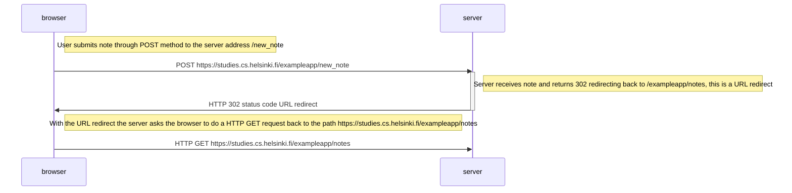

```mermaid
    sequenceDiagram
        participant browser
        participant server

        Note right of browser: User submits note through POST method to the server address /new_note
        browser->>server: POST https://studies.cs.helsinki.fi/exampleapp/new_note
        activate server
        Note right of server: Server receives note and returns 302 redirecting back to /exampleapp/notes, this is a URL redirect
        server->>browser: HTTP 302 status code URL redirect
        deactivate server

        Note right of browser: With the URL redirect the server asks the browser to do a HTTP GET request back to the path https://studies.cs.helsinki.fi/exampleapp/notes
        browser->>server: HTTP GET https://studies.cs.helsinki.fi/exampleapp/notes
        

        
        
```
