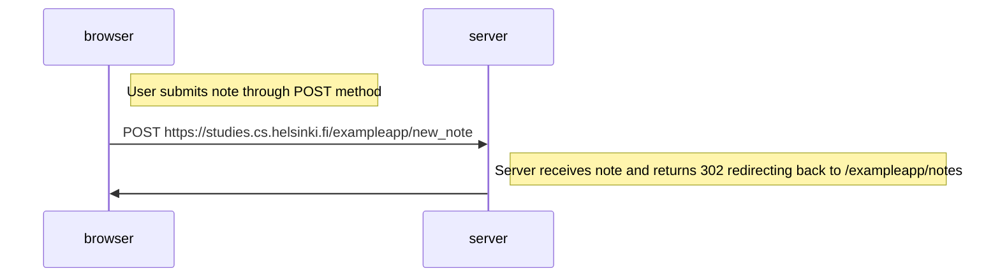

```mermaid
    sequenceDiagram
        participant browser
        participant server

        Note right of browser: User submits note through POST method
        browser->>server: POST https://studies.cs.helsinki.fi/exampleapp/new_note

        Note right of server: Server receives note and returns 302 redirecting back to /exampleapp/notes
        server->>browser: 
        
```
