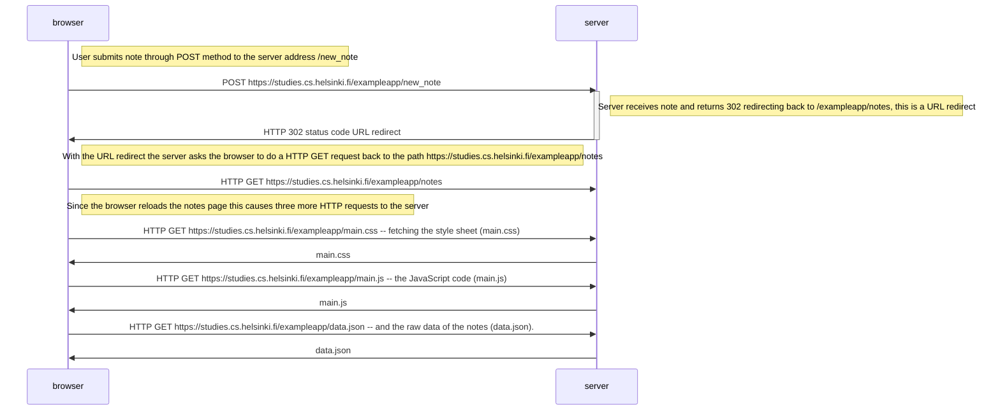

```mermaid
    sequenceDiagram
        participant browser
        participant server

        Note right of browser: User submits note through POST method to the server address /new_note
        browser->>server: POST https://studies.cs.helsinki.fi/exampleapp/new_note
        activate server
        Note right of server: Server receives note and returns 302 redirecting back to /exampleapp/notes, this is a URL redirect
        server->>browser: HTTP 302 status code URL redirect
        deactivate server

        Note right of browser: With the URL redirect the server asks the browser to do a HTTP GET request back to the path https://studies.cs.helsinki.fi/exampleapp/notes
        browser->>server: HTTP GET https://studies.cs.helsinki.fi/exampleapp/notes
        Note right of browser: Since the browser reloads the notes page this causes three more HTTP requests to the server
        browser->>server: HTTP GET https://studies.cs.helsinki.fi/exampleapp/main.css -- fetching the style sheet (main.css)
        server->>browser: main.css
        browser->>server: HTTP GET https://studies.cs.helsinki.fi/exampleapp/main.js -- the JavaScript code (main.js)
        server->>browser: main.js
        browser->>server: HTTP GET https://studies.cs.helsinki.fi/exampleapp/data.json -- and the raw data of the notes (data.json).
        server->>browser: data.json

        
        
```
