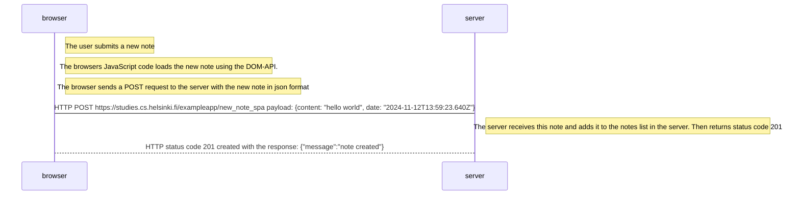

```mermaid
  sequenceDiagram
    participant browser
    participant server

    Note right of browser: The user submits a new note
    Note right of browser: The browsers JavaScript code loads the new note using the DOM-API.
    Note right of browser: The browser sends a POST request to the server with the new note in json format
    browser->server: HTTP POST https://studies.cs.helsinki.fi/exampleapp/new_note_spa payload: {content: "hello world", date: "2024-11-12T13:59:23.640Z"}
    Note right of server: The server receives this note and adds it to the notes list in the server. Then returns status code 201
    server-->browser: HTTP status code 201 created with the response: {"message":"note created"}

```
