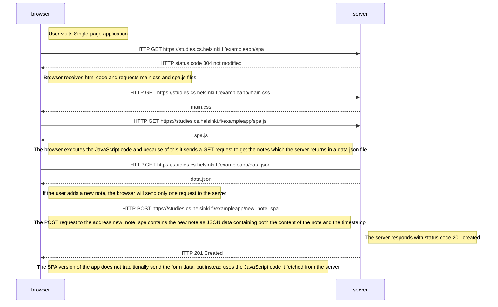

```mermaid
  sequenceDiagram
    participant browser
    participant server

    Note right of browser: User visits Single-page application
    browser->>server: HTTP GET https://studies.cs.helsinki.fi/exampleapp/spa
    server-->>browser: HTTP status code 304 not modified
    Note right of browser: Browser receives html code and requests main.css and spa.js files
    browser->>server: HTTP GET https://studies.cs.helsinki.fi/exampleapp/main.css
    server-->>browser: main.css
    browser->>server: HTTP GET https://studies.cs.helsinki.fi/exampleapp/spa.js
    server-->>browser: spa.js
    Note right of browser: The browser executes the JavaScript code and because of this it sends a GET request to get the notes which the server returns in a data.json file
    browser->server: HTTP GET https://studies.cs.helsinki.fi/exampleapp/data.json
    server-->>browser: data.json


    Note right of browser: If the user adds a new note, the browser will send only one request to the server
    browser->server: HTTP POST https://studies.cs.helsinki.fi/exampleapp/new_note_spa
    Note right of browser: The POST request to the address new_note_spa contains the new note as JSON data containing both the content of the note and the timestamp
    Note right of server: The server responds with status code 201 created
    server-->>browser: HTTP 201 Created
    Note right of browser: The SPA version of the app does not traditionally send the form data, but instead uses the JavaScript code it fetched from the server
```
